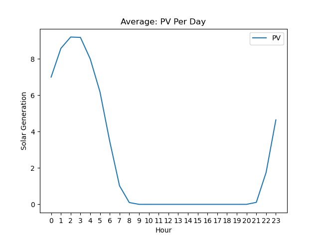
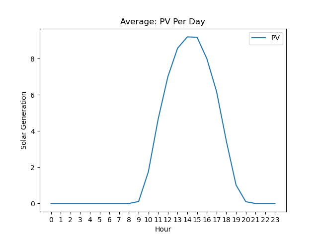

### 1.Purposes
Our climate is changing every single day because we consume more fuel since we have discovered the power of fuel. We believe that we should shift to using more recyclable energy sources like solar. However, generating power by solar is unstable because of the weather conditions, and [a new reserach](https://www.sciencedirect.com/science/article/abs/pii/S0306261921008898?via%3Dihub) found how weather events can reduce the amount of energy produced by the United States. To solve the problem, we need to predict the generation of power, and we can store the power in the battery effectively. This project demonstrates how to predict the generation of power for 7 days by using machine learning.

### 2.Dependecy 
- Python

### 3.Data Analysis: Post Code 5000 Data Set

Between 9 p.m. and 7 a.m., PV is generated. On the other hand, in the daytime (8 a.m. to 8 p.m.), PV is not generated for 3 months on average. As a result, we can assume that the time should be switched between a.m. and p.m. Otherwise, Adelade has the sunlight at midnight.

After switching between the daytime and nighttime, we can clearly and logically see the actual PV behaviors.