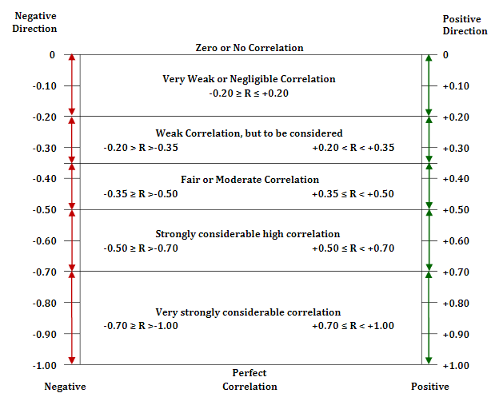

### 1.Purposes
Our climate is changing every single day because we consume more fuel since we have discovered the power of fuel. We believe that we should shift to using more recyclable energy sources like solar. However, generating power by solar is unstable because of the weather conditions, and [a new reserach](https://www.sciencedirect.com/science/article/abs/pii/S0306261921008898?via%3Dihub) found how weather events can reduce the amount of energy produced by the United States. To solve the problem, we need to predict the generation of power, and we can store the power in the battery effectively. This project demonstrates how to predict the generation of power for 7 days by using machine learning.

### 2.Dependecy 
- Python
- pvlib

### 3.Data Analysis: Post Code 5000 Data Set

Between 9 p.m. and 7 a.m., PV is generated. On the other hand, in the daytime (8 a.m. to 8 p.m.), PV is not generated for 3 months on average. As a result, we can assume that the time should be switched between a.m. and p.m. Otherwise, Adelaide has the sunlight at midnight.

After switching between the daytime and nighttime, we can clearly and logically see the actual PV behaviors.

Since the research found the correlation between PV and weather, we need to add weather conditions to our dataset. Thus, we concatenate [weather datasets](http://www.bom.gov.au/climate/dwo/IDCJDW5081.latest.shtml) into our dataframe. From the weather dataset, we extract rain and temperature. However, the dataset does not cover every hour of temperature and rain information. We alternatively select values following the methods.
- Rain: Assume that if it rains in Adelaide on a given day, we assume that it will rain all day.  
On April 6, there was 5.2 mm of rain. So, every hour contains 5.2 mm of rain.
- Temperature: There are 4 temperatures in the dataset; min, max, 9 am and 3 pm.  
Before 7 am, we assume the temperature is min. 
Between 8 and 10 am, we assume the temperature is the same as at 9 am. 
Between 11 am and 1 pm, we assume the temperature is max. 
Between 2 and 4 pm, we assume the temperature is the same as at 3 am. 
After 5 pm, we assume the temperature is min. 

We compare PV generation to that of the sun and rain. From the above picture, we can see that rain drops are on the PV. In particular, around noon (peak) it is clearly different, but not much.  From this fact, we can assume the correlation values would be lower, and the table is below.

Correlation between PV and Time, Weather, and Temperature: 

|     | PV  | Time | Weather | Temperature |
|:---:| :---: | :---: | :---: | :---: |
| PV  | 1.0 | -0.558 | -0.08 | -0.18 | 

From the above table, there is negatively strong relation between PV and Time.

[More details](https://www.researchgate.net/publication/334308527_Usefulness_of_Correlation_Analysis)

Thus, we can say that PV and the Sun of the position matter. 
We calculate the solar elevation angles to calculate Zenith angles. 

The solar elevation formula is as follows: 

sin(ɑ) = sin(ɸ)sin(δ) + cos(ɸ)cos(δ)cos(h)

Where ɑ is the solar elevation angle, δ is the declination angle, ɸ is the latitude of your location, and h is the solar hour angle.

From the above picture, we can see that the solar zenith angle covers the surface of the solar panels. When the zenith angles are large such as around noon, the solar panels generate more PV. 
Also,  the below correlation table shows that solar zentih angles are more related to PV than Time.

|     | PV  | Time | Weather | Temperature | Zenith |
|:---:| :---: | :---: | :---: | :---: | :---: |
| PV  | 1.0 | -0.558 | -0.08 | -0.18 | -0.725 |

We save the dataframe with Time, Temperature, Weather, and Zenith to apply machine learning.

### 4.Machine Learning
To predict the 7-day PV forecast, we split the dataset into train and test by date. So, the last 7 days (6/21-28) are on the test.
Then, we explore outliers in the test dataset.

From the above image, we do not see any outliers, so we do not apply any imputation at this stage. As we can see, there are different values on the x-axis in the picture, and we apply a standard scaler before machine learning.  
For discovering the best model for the dataset, we consider  3 ensemble learnning; [RandomForest](https://scikit-learn.org/stable/modules/generated/sklearn.ensemble.RandomForestClassifier.html), [AdaBoost](https://scikit-learn.org/stable/modules/generated/sklearn.ensemble.AdaBoostRegressor.html#sklearn.ensemble.AdaBoostRegressor), and [GradinetBoost](https://scikit-learn.org/stable/modules/generated/sklearn.ensemble.GradientBoostingRegressor.html#sklearn.ensemble.GradientBoostingRegressor) as our candidates.
We also apply the [gridsearch method](https://scikit-learn.org/stable/modules/generated/sklearn.model_selection.GridSearchCV.html#sklearn.model_selection.GridSearchCV) for our fine-tuning when cross validation is 5 and scoring is R Squared.
We discover that the best model from them:  

|                 Model                 | R2 | Params |  MSE  | RMSE  |
|:-------------------------------------:|:---:|:------:|:-----:|:-----:|
| RandomForestRegressor(random_state=0) | 0.64 | 'max_depth': 5, 'n_estimators': 100 | 2.21 | 1.49 |

Our RMSE is 1.49, and we can expect that our error (of standard deviation ) is small. It is pretty accurate.
Thus, we predict PV with the model and plot the below picture.

The red line is our prediction, and the line is pretty similar. However, around 3 p.m., our prediction is different. There were some reasons why we could not predict it there. First, the rain and temperature were not precise as we covered the entire field. So, they are sort of noise. Second, we do not have enough columns to predict well. So, collecting more relevant data is our future study at this stage.
